## Handwritten Digit Recognition with a Back-Propagation Network, 1990

Y. Le Cun, B. Boser, J. S. Denker, D. Henderson, R. E. Howard, W. Hubbard, and L. D. Jackel

a.k.a. LeCun90c

---

## Yann LeCun


Chief AI Scientist (and several other titles) at Facebook, "founding father of convolutional nets."

---

## Yann Le Cun vs. Yann LeCun

> All kinds of badly programmed computers thought that "Le" was my middle name. Even the science citation index knew me as "Y. L. Cun", which is one of the reasons I now spell my name "LeCun".
>
> From Yann's [Fun Stuff](http://yann.lecun.com/ex/fun/) page
>
> Also: [Falsehoods Programmers Believe About Names](https://www.kalzumeus.com/2010/06/17/falsehoods-programmers-believe-about-names/)

---

### The Problem

How to turn handwritten ZIP codes from envelopes into numbers

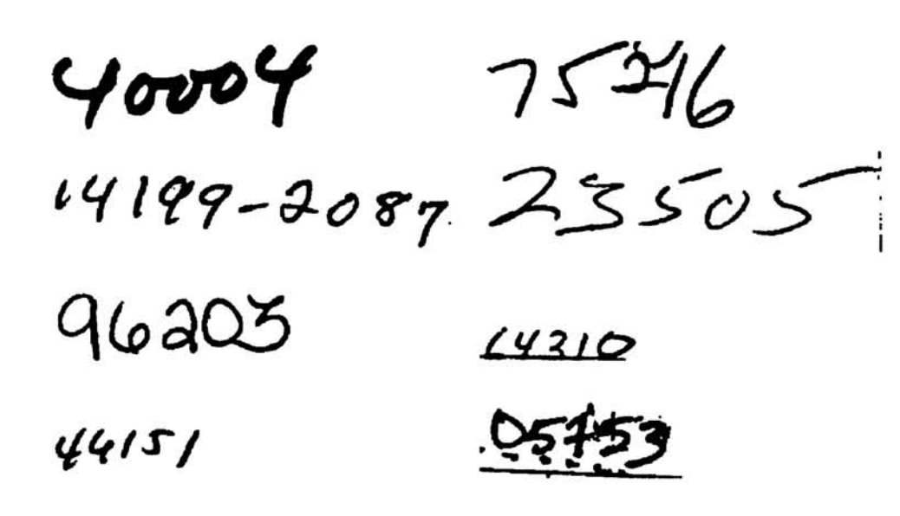

---

### NOT The Problem

* Location on the envelope
* Digitization
* Segmentation

**ONLY** concerned with converting a single digit's image into a number

---

### Why is this a good problem?


---

## Neocognitron


Inspiration for CNNs, based on the relationship between the human eye and brain. A large difference is that LeCun used backprop, which makes the paper much simpler to read and the output more effective!

---

## Original data

After segmentation, ~40x60 pixel greyscale image .

**How much of this information do we need?**

*What* is the information we need?

---

## Why reduce information?

* Reduce overfitting (improve generalization)
* Reduce training time (increase epochs)

---

## Network Input

16x16 grid of greyscale values, from `-1` to `1`.


Normalized from ~40x60px original, preserving aspect ratio. Network needs consistent size!

---

## Network Output

**To a human:** Potential classes of `0`, `1`, `2`...`9`

**To the computer:** Ten nodes, activated from `-1` to `+1`. Higher value means higher probability of it being that digit. More or less one-hot encoding.

---

## Output example

Given the output 

```[0 0 0.5 1 0 -0.3 -0.5 0 0.75 0]```

The network's prediction is **nine** because `0.75` is the highest number. Next most probable is a **three** with a score of `0.5`.

---

## Four Hidden Layers

* **Input:** 16x16 greyscale input
* **H1**: Feature layer
* **H2**: Averaging layer
* **H3**: Feature layer
* **H4**: Averaging layer
* **Output:** 10x1 encoding

*Not* fully-connected. "A fully connected network with enough discriminative power for the task would have far too many parameters to be able to generalize correctly."

---

## Convolution

A **convolution** is used to "see" patterns around a pixel like horizontal, vertical or diagonal edges.

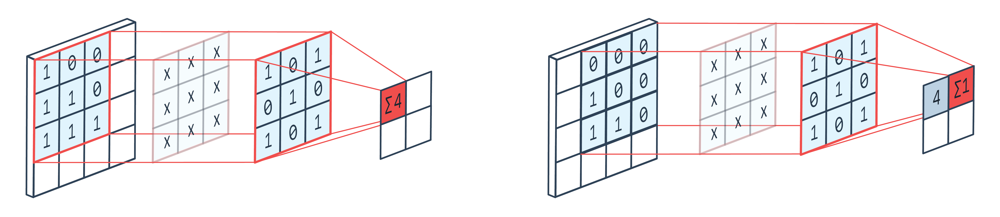

It's just linear algebra: a **kernel** is applied to create a new version of a pixel dependent on the pixels around it. The kernel (or convolutional matrix) is just a matrix that is multiplied against each pixel and its surroundings.

---

## Application of the convolution

Edges of the image are padded with `-1` to allow kernel to be applied to outermost pixels. The result is called a **feature map**.


---

## A single kernel map

The `-1` `+1` range of each feature map highlights a specific type of feature at a specific location.

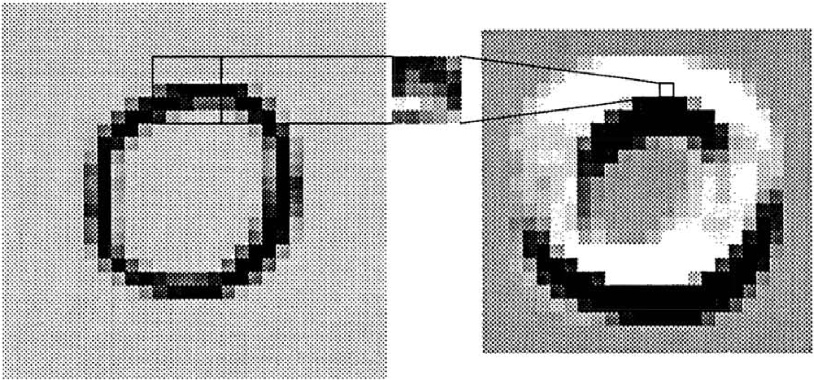

---

## Layer: H1

Four different 5x5 kernels are applied, creating four different 576-node feature maps that each highlight a different type of feature.

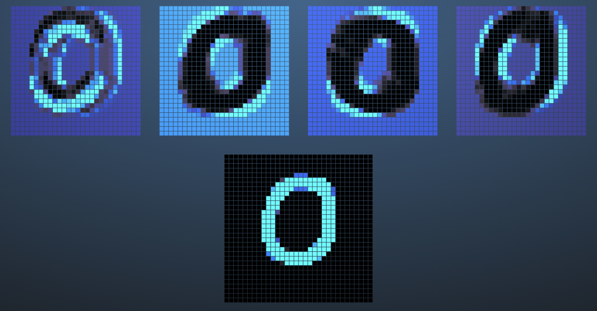

---

## Layer: H2

We don't need all that detail, though! Layer H2 averages the 24x24 feature maps down to 12x12, converting local sets of 4 nodes in H1 to a single node in H2.


---

## Layer: H3

H3 is another feature layer, operating just like H1 but generating twelve 8x8 feature maps. Each kernel is again 5x5.


---

## H2-H3 connections

Note that **not all H3 kernels are applied to all H2 layers**. Selection is "guided by prior knowledge of shape recognition." This simplifies the network.

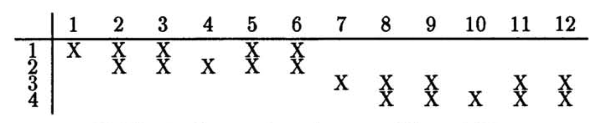

---

## Layer: H4

H4 is similar to H2, in that it averages the previous layer.

This reduces H3's 8x8 size to 4x4. 


---

## Output

10 nodes, fully connected to H4. Each activates between `-1` and `+1` with a higher score meaning a more likely prediction for that digit.

---

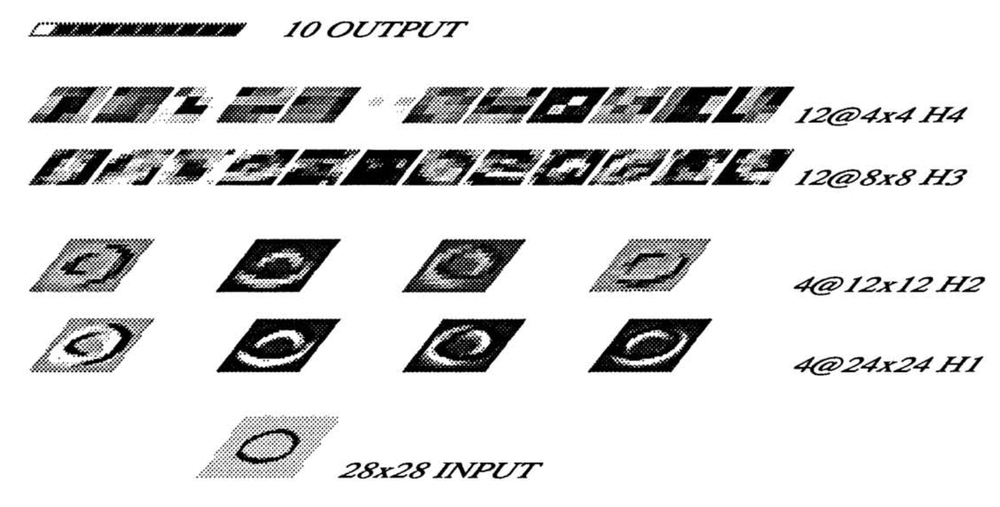

---

## Overall

* 4,635 nodes, 98,442 connections, 2,578 independent parameters
* Did **not** depend on elaborate feature extraction, only rough spatial and geometric information.

### Training and testing

* Weights adjusted using backpropagation
* Trained on 7,291 handwritten + 2,549 printed digits with 30 epochs
* Test set error rate was 3.4%
* Errors were half due to faulty segmentation, and some human beings couldn't even read!

---

## Performance

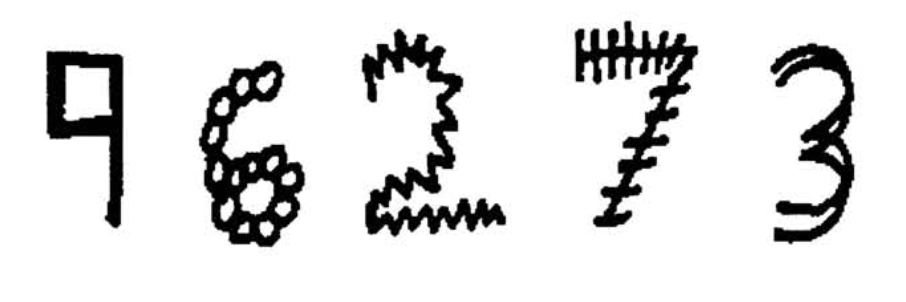

Robust model that generalizes very well when presented with unusual representations of digits.

Throughput is mainly limited by the normalization step! Reaches 10-12 classifications per second.

---

## The birth of CNNs!

But then they went to sleep for one of the many AI winters. For successful deep learning you generally need:

* A lot of data
* A lot of processing power (or tricks to speed things up)

---

# Time passes

---

## The Problem

**ImageNet:** 15 million labeled high-res images, belonging to ~22,000 categories. Labeled by people on Mechanical Turk.

**ILSVRC:** ImageNet Large-Scale Visual Recognition Challenge - subset of ImageNet with 1,000 images in each of 1,000 categories

---

## ImageNet 2010 entrants

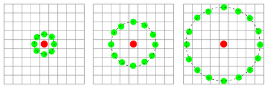


Up until 2012, [the entrants](http://image-net.org/challenges/LSVRC/2010/results) were very concerned with quick, manually engineered features and SVMs.

---

## ImageNet 2010 results

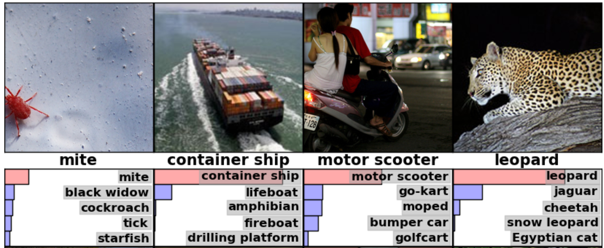

Best performance error rates:

* top-1: 47.1%, 45.7%
* top-5: 28.2%, 25.7%

---

## ImageNet Classification with Deep Convolutional Neural Networks, 2012

Alex Krizhevsky, Ilya Sutskever, Geoffrey E. Hinton

---

## The Approach

Another CNN! But bigger, deeper, and much more optimized.

*But also remarkably similar to LeCun90c!*

---

## Preprocessing original data

Input was variable-size normal images.


* Downsampled to >256x256
* Then cropped to 256x256 pixels
* RGB values converted to distance from mean pixel value

*Why are we keeping RGB values? What are downsides of using RGB?*

---

## Model Input

*Not the 256x256 image!* 244x244 images instead.


Top left, top right, bottom left, bottom right, and center. Reflected, too. Can actually create these on CPU while the GPU is working.

*What's the point of doing this? They're basically the same image!*

---

## Network Layers

* **Input:** 244x244x3 image
* **L1:** 96 kernels of 11x11x3 w/ stride of 4.
* **L2:** 256 kernels of 5x5x48
* **L3:** 384 kernels of 3x3x256
* **L4:** 256 kernels of 3x3x192
* **L5:** 256 kernels of 3x3x192
* **Dense layers:** two 2048-node fully-connected layers
* **Output:** 1000 nodes

Very deep - LeCun's only had two convolutional layers. Why do we suddenly have all these extra layers?

*What is missing compared to LeCun's digit analysis?*

---

## Reduction

**LeCun90c:** "Averaging layer," take 2x2 pixel area and condense to 1 pixel

**AlexNet:** "Pooling" - take every other pixel, average with the surrounding 8 pixels. This resizes the same amount, but with overlap!


Happens on layers 1, 2 and 5. *Why wouldn't you do this on every layer? Why do this at all?*

---

## Response normalization 

**Force competition between kernels at the same location.**

If a lot of kernels have high levels of activity, adjust so only the most active ones express themselves.

a.k.a. if an area has a few features, the network mostly notices the most obvious ones. 

Occurs after convolution but before max pooling.

*Why not just focus on all of the features?*

---

### ReLUs

Uses ReLUs instead of hyperbolic tangent for neuron model.

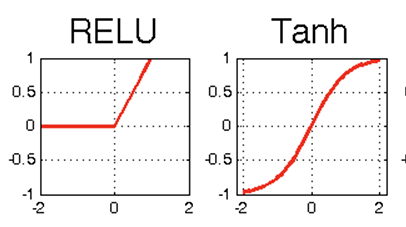

* tanh is **saturating** because it's squashed into 0-1, and near 0 or 1 there isn't much change
* ReLU is **nonsaturating**, so it will converge faster because gradients are larger

*Why is training speed important?*

---

Can do in 5 epochs what would have taken ~37 epochs with tanh!


**Limiting factor for model is training time.** Decreasing training time = increase dataset or train longer.

---

## GPUs vs CPUs

Wrote a GPU implementation of 2D convolutions. GPUs are excellent at running computations in parallel, which allowed a much larger CNN than previous work.

> In the end, the network’s size is limited mainly by the amount of memory available on current GPUs and by the amount of training time that we are willing to tolerate. Our network takes between five and six days to train on two GTX 580 3GB GPUs. All of our experiments suggest that our results can be improved simply by waiting for faster GPUs and bigger datasets to become available.

---

## Another speedup: *multiple* GPUs

Feature maps are spread across two GPUs, GPUs only talk to each other between the 2nd and 3rd layers and after the last conv layer.

Parallelization = speedup = more training epochs

Similar to a "columnar" CNN.


---

# Layers


---

## Dropout

It would be nice to combine multiple prediction models, but too expensive even with the speedups!

Instead, **DROPOUT:** during training, randomly set half of the neurons to 0 and don't let them participate. Almost like having multiple models, and only increases training time 1-2x.

It's like breaking your hand and having to write with your non-dominant one.

*Only used in the first two layers.*

---

## Performance: top-1 vs top-5


* Top 1 error rate: 37.5
* Top 5 error rate: 17.0

---

## Performance: top-1 vs top-5

Amazing performance! Blows the competition out of the water!

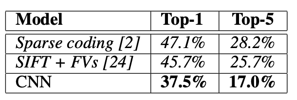

Also tested against ImageNet 2009, top-1 and top-5 error rates
were 67.4% and 40.9% compared to best published results on of 78.1% and 60.9%.

---

## What is the right label?


---

## This was the beginning

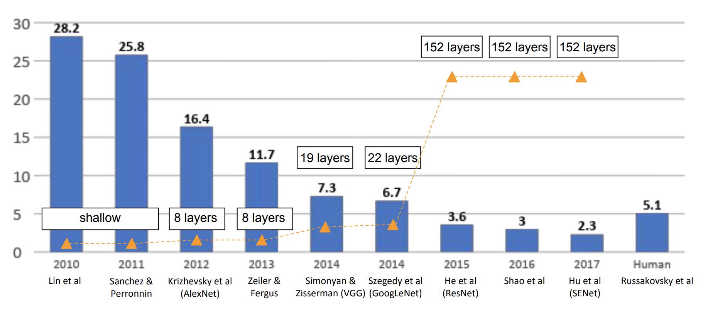

After 2017 ImageNet stopped hosting because the models were too good, beating humans!

---

## 2013: VGGNet


7.3% top-5 error! 19 layers.

**Stacking convolutional layers:** Use multiple 3x3 layers instead of larger layers. Smaller filters, but deeper network!

---

## 2014: GoogLeNet


6.7% top-5 error! 22 layers.

**Inception module:** What size convolution should we use? *All of them!* Then let the network figure out which one to pay attention to. Far fewer parameters.

---

## 2015: ResNet


3.57% top-5 error! 152 layers!

**Residual blocks:** More layers aren't always better layers! Residual blocks have output of layer n feed into layer n+1 but also layer ~n+3. 

---

## Questions

* From a technical perspective, what changed between these 1990 and 2012 papers? What stayed the same? 
* What do we still use from AlexNet and what have we discarded?
* What role does computing power play in machine learning's capabilities?
* What role does a dataset play in the determination of ML capabilities?
* In both models we spend a lot of time discarding data. What happened to "more data is better data?"
* What features of these systems make them more or less robust/secure?

---

## Sources

* Uncited images from [Handwritten Digit Recognition with a Back-Propagation Network](https://www.bibsonomy.org/bibtex/1d0f161d61285aca3b30c3add9416921e/idsia)
* 3x3 kernel image from [https://peltarion.com/knowledge-center/documentation/modeling-view/build-an-ai-model/blocks/2d-convolution-block](https://peltarion.com/knowledge-center/documentation/modeling-view/build-an-ai-model/blocks/2d-convolution-block)
* Sliding kernel application from [https://github.com/vdumoulin/conv_arithmetic](https://github.com/vdumoulin/conv_arithmetic)
* Activated images network from [https://www.cs.ryerson.ca/~aharley/vis/conv/flat.html](https://www.cs.ryerson.ca/~aharley/vis/conv/flat.html)
* LBP from [Wikipedia](https://en.wikipedia.org/wiki/File:Lbp_neighbors.svg)
* ImageNet performance images from [these slides](http://cs231n.stanford.edu/slides/2019/cs231n_2019_lecture09.pdf)
* Batch normalization [excellent explanation in this video](https://www.youtube.com/watch?v=DtEq44FTPM4)